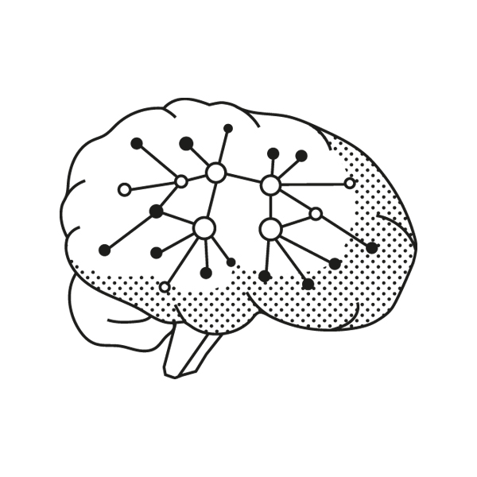

public:: true

- https://fs.blog/mental-models/
- {:height 219, :width 299}
- What Are Mental Models?
	- 世界很复杂，模型帮我们简化
- Learning to Think Better
	- ==多维思考== --> 盲点会杀死你
	- > 工程师会从系统中思考。
	  心理学家会从激励的角度来思考。
	  生物学家会从进化的角度思考
	- Sharing knowledge, or learning the basics of the other disciplines, would lead to a more well-rounded understanding that would allow for better initial decisions.
		- 立场不同、背景不同都会有不同的决策。
- > Building your latticework is a **lifelong project**. Stick with it, and you’ll find that your ability to understand reality, make consistently good decisions, and help those you love will always be improving
- ## [[核心思维模型]]
- ## [[生物学思维模型]]
  id:: 620c6a5a-1e94-447c-9ba8-7024d7f66b32
  collapsed:: true
	- {{embed [[生物学思维模型]]}}
- ## [[物理化学思维模型]]
  collapsed:: true
	- {{embed [[物理化学思维模型]]}}
- ## [[系统思维模型]]
- ## [[数学思维模型]]
- ## [[微观经济学思维模型]]
- ## [[军事思维模型]]
- ## [[人类本质和判断]]
-
- 参考文献：
	- [世界的真相](https://www.zhihu.com/question/486546847/answer/2318907500)